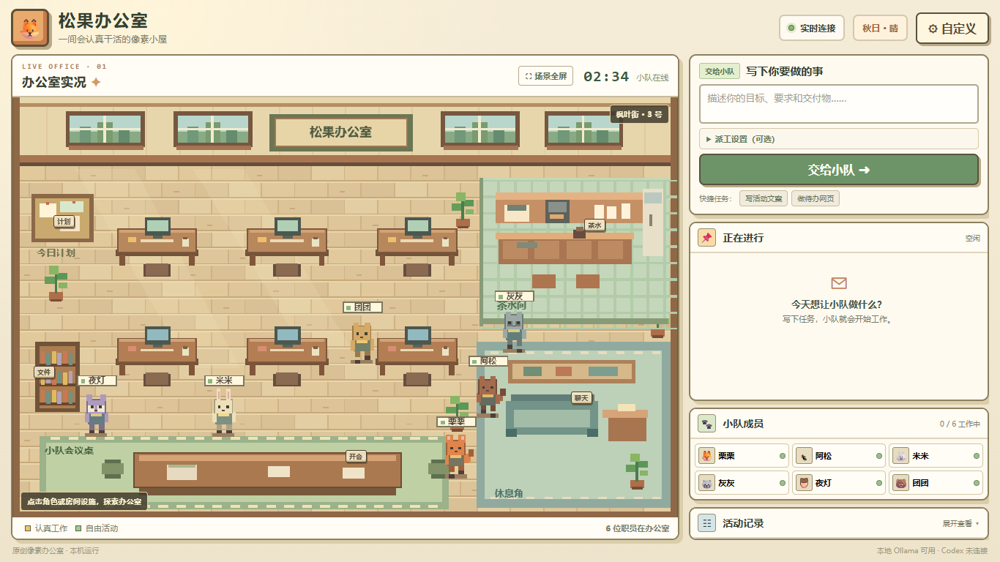

# Pixel Agent Office · 松果办公室

> Put your AI agents in a living, top-down pixel office. Describe a goal; they decide how to divide the work, walk to their desks, and show you what happened.

**Local-first · Automatic task routing · Multi-agent collaboration · Customizable team · Original pixel art**

[简体中文](README.md) · [Quick start](#quick-start) · [Connect agents](#connect-agents) · [MIT license](LICENSE)

## What is this?

Pixel Agent Office is an open-source **visual workspace for AI agents**. It turns task submission, executor selection, and progress tracking into a small office with characters, desks, and interactive rooms. You do not have to choose a collaboration mode before every task: by default, a configured agent analyzes the request and selects solo work, sequential handoff, or parallel collaboration.

For example, ask for a to-do web page and a user guide. The team first explains its routing choice. During execution, characters move and sit at their desks while the task card shows which agent is working, the reason for the assignment, each step and handoff, and the final output. You can copy the result or inspect files in the workspace.

*The screenshot comes from a separate instance with empty task data. Your office changes with your team and settings.*

## Feature tour

| What you can do | How it works |
| --- | --- |
| **Send any task from one box** | Describe your goal and click “Send to team.” Tasks are not limited to predefined categories; the actual capabilities come from the agents you connect. |
| **Let AI route the work** | An agent judges the request and chooses solo, sequential, or parallel execution. The task card shows its reason; obvious one-sentence and short-answer requests are kept with one member. |
| **Watch the work happen** | Members walk to their desks and sit down. The live panel shows progress, activity, individual outputs, handoffs, and the final result. You can stop a running task. |
| **Build your own team** | Configure 1–8 members: names, roles, expertise, routing keywords, personal instructions, animal sprites, colors, and agent bindings. |
| **Connect different agents** | Guided options for Ollama, Codex, Claude Code, Hermes, DeepSeek, OpenRouter, and OpenAI API, plus advanced compatible API, custom HTTP JSON, and local command-line integrations. |
| **Explore the office** | Click characters and room signs. Keep notes on the board, arrange work at the meeting table, browse workspace files on the shelf, change the daylight in the kitchen, or talk to a member in the lounge. |
| **Make it yours** | Change the office name, subtitle, location sign, emoji or image logo, quick tasks, day/night setting, idle movement, and short-task animation timing. The scene can fill the screen. |

### Automatic routing and manual control

The default path is **analyze → assign → execute → show result**. Automatic routing uses up to three members:

- **Solo:** one member handles a single, small deliverable.
- **Sequential handoff:** each member receives the previous member's output.
- **Parallel:** members work on distinct parts at the same time, then the lead synthesizes a final result.

If the routing response cannot be parsed, the originally selected member handles the task alone and the task card explains the fallback. Open **“Dispatch settings (optional)”** to choose the member, executor, or collaboration mode yourself. Only one top-level task runs at a time.

### Things to click in the office

- **Characters:** see a member's name, expertise, connected agent, and recent work; assign them a task.
- **Planning board:** add, finish, or delete notes and inspect recent tasks.
- **Meeting table:** return to task entry with automatic routing or a manual sequential/parallel choice.
- **Workspace shelf:** refresh the file list and preview small text files.
- **Kitchen:** follow local time or set permanent day or night.
- **Lounge:** send a real task directly to a selected member and see the reply in the task card.

The dashboard fits common desktop window sizes with long results scrolling inside the task panel. Narrow screens use a vertical layout.

## Quick start

Requires **Node.js 20 or newer**. There are no runtime npm dependencies; `npm install` is not needed.

1. [Download the repository ZIP](https://github.com/vmayfuture/pixel-agent-office/archive/refs/heads/main.zip) and extract it, or run `git clone https://github.com/vmayfuture/pixel-agent-office.git`.
2. On Windows, double-click [启动办公室.cmd](启动办公室.cmd). On macOS or Linux, run `node server.mjs` in the project directory. `npm start` works as well.
3. Open <http://127.0.0.1:4321> and choose **Customize → Connect Agent**. Pick a service you already have, follow the guided setup, and save.
4. Describe a task and click **Send to team**. AI routing is the default.

The server listens only on `127.0.0.1`; close its terminal to stop it. The default port is `4321` and can be changed with `PIXEL_OFFICE_PORT`.

## Connect agents

The guided setup follows **choose service → enter a key or select a local model → assign members → save**. To start quickly, click **Use for all members**; individual bindings can be changed later.

| Integration | What you need | What it provides |
| --- | --- | --- |
| **Local Ollama model** | Running Ollama and a downloaded model | Detected models appear in the UI; the app can pick an available model automatically. |
| **Codex** | Installed and authenticated Codex CLI | Runs tasks with Codex's own tools and local file capabilities. |
| **Claude Code** | Installed and authenticated Claude Code CLI | Runs `claude -p` in the local workspace, with the file editing and tools Claude Code permits. |
| **Hermes Agent** | A working Hermes installation | Sends tasks to Hermes; Hermes manages its own internal subagents. |
| **DeepSeek / OpenRouter / OpenAI API** | The provider's API key and, if needed, a model ID | Service templates fill the base URL and send text through `/chat/completions`. |
| **Other agents and APIs** | A local command or provider documentation | Advanced settings support compatible APIs, custom HTTP JSON, and command-line agents. |

Each member can use a different agent. An API key is separate from a ChatGPT web login. Cost, network access, file operations, and tool use depend on the service you configure. The compatible API integration itself sends text requests only; for local files or tools, bind a command-line agent that supports them.

### Connect Claude Code

1. Install the CLI using the [official Claude Code setup guide](https://code.claude.com/docs/en/setup). In a terminal, run `claude --version`, `claude auth login`, then `claude auth status` to confirm you are signed in. If the office was already running before installation, restart it so it can read the updated PATH.
2. In the office, open **Customize → Connect agents → Claude Code**. Enable it, choose **Use for all members** or assign individual members, and save. This uses the local Claude Code login; **no API key is entered in the office**.
3. When you submit a task, the office runs Claude Code non-interactively in `workspace/`. The preset permits file edits; other tools still follow your Claude Code permissions. Results and workspace files appear in the task panel.

This project's solo, relay, and parallel modes still coordinate the office team. Claude Code can use its own subagents if configured, but their individual steps are not displayed as separate office characters. The connection status checks that the command runs and is authenticated; completing a task also depends on your Claude Code account, permissions, and available tools. Use Advanced integrations if you need to change the command or permission flags.

## Customization and local data

Settings let you change:

- **Brand and scene:** name, subtitle, location sign, logo, daylight, idle movement, and animation timing.
- **Team:** size, order, names, expertise, routing keywords, personal instructions, appearance, and agent bindings.
- **Quick tasks:** button title, prompt, member, and executor.
- **Advanced integrations:** multiple executors, URLs, request formats, CLI arguments, and persistent instructions.

Configuration lives in `data/settings.json`. API keys are stored separately in `data/provider-secrets.json` and are not returned in full by the page state endpoint. Task history and planning notes live in `data/tasks.json` and `data/board.json`. Command-line agents work in `workspace/`. Git ignores these directories: **do not commit personal data or keys to a public repository**.

## Current limits

- AI can make a poor routing choice; use manual dispatch when you need a fixed workflow.
- Claude Code and Hermes must be installed and working independently. This project does not install or repair them. For a custom Hermes startup script, use advanced settings or `PIXEL_OFFICE_HERMES_SCRIPT`.
- Compatible API integration currently uses Chat Completions. Other protocols require custom advanced HTTP setup following your provider's documentation.
- Custom command-line agents run as your local user. Configure only commands you trust and check the permissions and costs of each service.

The scene and characters are original pixel art and do not use assets from Stardew Valley or other products. Licensed under [MIT](LICENSE).

**Related search terms:** visual AI agent office, pixel art AI workspace, multi-agent dashboard, automatic task routing, top-down pixel art, Ollama, Codex, Claude Code, Hermes.
